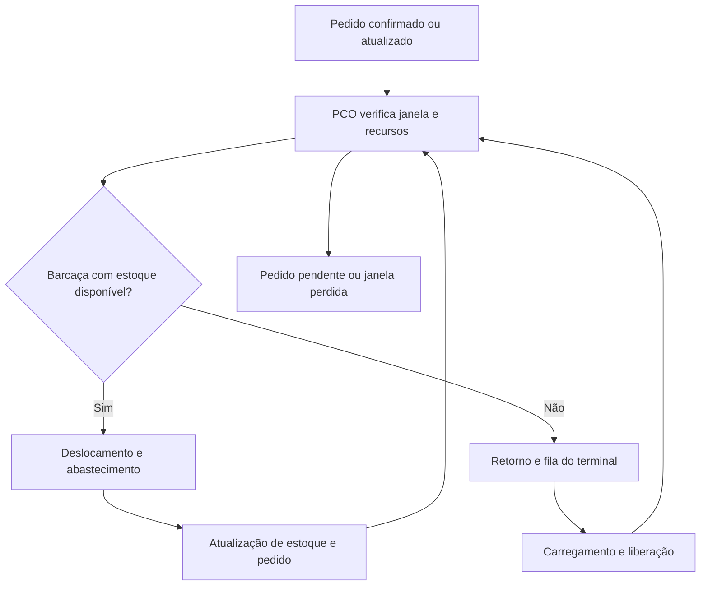

# Modelo conceitual — operação de bunkering da BVE

**Grupo:** G009  
**Versão:** 0.2 — 23/09/2026  
**Estado:** proposta conceitual; parâmetros e políticas sujeitos à validação operacional.

| Versão | Data | Alteração | Responsável |
|---|---|---|---|
| 0.1 | 23/09/2026 | Estrutura inicial dos quatro processos, regras e indicadores | Grupo G009 — confirmar |
| 0.2 | 23/09/2026 | Identificação do grupo G009 e inclusão dos integrantes | Atualização cadastral |

| Nome completo | Número USP |
|---|---|
| Carla Sahuquillo | 18401953 |
| Chloé Brangerieau | 18420440 |
| Guilherme Teixeira Costa | 13725570 |
| José Pedro Coimbra | 15638527 |

## 1. Finalidade e fronteiras

O modelo estimará a capacidade sustentável da operação e avaliará alternativas para elevá-la em 20%, conforme a proposta. A simulação de eventos discretos representará desde a entrada do pedido até sua conclusão ou perda, incluindo os ciclos de recarga das barcaças. Atracação dos navios, reposição do terminal e condições ambientais serão entradas externas, sem modelar toda a operação portuária.

A referência é a seção 3 de Costa e Mesquita (2023). O artigo descreve seis barcaças, dois berços de carregamento, programação às 9h30 e 16h30 e horizonte aproximado de 36 horas. Esses dados caracterizam o caso estudado no artigo; sua aplicação à BVE depende de confirmação. A inclusão explícita de recargas e filas do terminal pertence ao modelo aqui proposto.

## 2. Entidades, recursos e estados

| Elemento | Atributos/estados mínimos |
|---|---|
| Pedido de abastecimento | Identificador, navio, produto, quantidade em t, local, confirmação, liberação, prazo comercial, janela física, prioridade e situação |
| Barcaça | Identificador, capacidade útil por produto, estoque remanescente, vazão, localização, disponibilidade e compatibilidades |
| Estado da barcaça | Ociosa, deslocando, aguardando navio, abastecendo, retornando, aguardando terminal, carregando ou indisponível |
| Terminal BVE | Estoque por produto, reposições, berços, bombas, vazões e calendários |
| PCO | Pedidos conhecidos, programação vigente, reservas, regras de prioridade e gatilhos de revisão |
| Filas | Pedidos elegíveis sem alocação; barcaças aguardando carregamento |

Cada barcaça executa uma atividade por vez. Um pedido é atendido por uma única barcaça, sem fracionamento, como hipótese inicial. Pedidos incompatíveis com toda a frota serão registrados como inviáveis; eventual atendimento fracionado exigirá revisão explícita. Produtos serão controlados separadamente, sem mistura de estoques.

## 3. Fluxo operacional

### Demanda dos navios

Pedidos chegam conforme registros históricos ou um processo estimado que preserve sazonalidade e dependências entre horário, quantidade, local e janela. A janela física começa quando o navio está disponível para abastecimento e termina em sua saída autorizada. Atualizações de atracação e cancelamentos alteram o pedido e acionam o PCO. O pedido só pode iniciar quando confirmado, liberado e fisicamente disponível.

### Abastecimento pelas barcaças

O PCO reserva pedido, barcaça e quantidade. A barcaça navega até o navio, aguarda sua liberação e executa aproximação, preparação, bombeamento e liberação. A duração é a soma desses componentes; o bombeamento corresponde à quantidade dividida pela vazão efetiva, limitada pelo conjunto barcaça–navio. Tempos totais observados poderão substituir componentes sem dupla contagem. Ao concluir, reduz-se o estoque e liberam-se pedido e barcaça. Havendo estoque e pedido compatível, a barcaça segue diretamente ao próximo navio.

### Carregamento no terminal

Sem estoque para a próxima missão, a barcaça retorna ao terminal. O carregamento exige simultaneamente berço, bomba compatível e combustível; recursos compartilhados não poderão ser duplicados. A fila inicial será FIFO entre barcaças elegíveis. A quantidade carregada será a necessária à missão programada, limitada pela capacidade livre e pelo estoque disponível. Essa política será confirmada com o operador. Preparação, bombeamento e liberação ocupam os recursos pelos respectivos tempos. O estoque do terminal é reduzido e o da barcaça aumentado pela mesma quantidade.

### Coordenação pelo PCO

Como política de referência provisória, o PCO reprogramará às 9h30 e 16h30, considerando 36 horas, e também após falhas, mudanças de janela ou cancelamentos. Operações iniciadas permanecem fixas, salvo interrupção física; reservas futuras podem ser refeitas.

A prioridade seguirá o caso descrito: passageiros; pedidos no prazo comercial do dia; menor término de janela. Empates serão resolvidos pela confirmação mais antiga e pelo identificador. Para cada pedido, seleciona-se uma barcaça compatível com estoque suficiente e término factível, preferindo menor deslocamento; empates usam menor término previsto e identificador. Na ausência de solução imediata, avalia-se recarga e mantém-se o pedido pendente. A política alternativa priorizará menor folga até o término da janela, conservando as restrições físicas.

## 4. Restrições, eventos e hipóteses

| Item | Regra de implementação |
|---|---|
| Janela física | Não iniciar antes da disponibilidade nem planejar término após a saída física; janela perdida gera registro de não atendimento |
| Prazo comercial | Pode ser anterior à saída física; atraso comercial é max(0, conclusão − prazo) |
| Estoque | Nunca negativo ou superior à capacidade; reservas impedem dupla alocação |
| Navegação | Tempo por origem, destino e barcaça; incluir restrições de calendário quando comprovadas |
| Falhas e clima | Bloqueiam recursos; retomada ou cancelamento conforme política confirmada; sem extensão automática da janela |
| Eventos simultâneos | Atualizar liberações, estoques e mudanças externas antes de uma única rodada de despacho |
| Eventos principais | Pedido, atualização, chegada, início/fim de serviço, início/fim de carga, falha, reparo e revisão do PCO |

Se uma perturbação tornar o término inviável durante o serviço, registrar quantidade entregue e janela violada; a continuidade física dependerá de regra aprovada pela BVE. Não se presumirá que o navio pode permanecer atracado indefinidamente.

## 5. Experimentos e indicadores

| Indicador | Definição |
|---|---|
| Produção | Toneladas efetivamente entregues / dias observados |
| Atendimento pontual | Pedidos concluídos integralmente na janela / pedidos elegíveis com janela encerrada |
| Não atendimento | Pedidos não concluídos integralmente até a saída / mesmos pedidos elegíveis |
| Espera | Início do abastecimento − disponibilidade física; média e P95 dos atendidos, acompanhados das perdas |
| Utilização | Horas por estado / horas disponíveis do recurso; manutenção informada separadamente |
| Carteira | Quantidade e volume pendentes ao longo do tempo; perdas acumuladas em indicador separado |

Cancelamentos comerciais anteriores ao atendimento serão excluídos do denominador e reportados separadamente. A definição operacional de capacidade será a da proposta. A demanda será ampliada gradualmente, preservando o perfil dos pedidos, até localizar o limite de serviço. Serão comparadas as capacidades das configurações, e não apenas demanda adicional de 20%.

## 6. Verificação e validação

A verificação examinará conservação de massa, exclusividade de recursos, janelas e casos pequenos calculados manualmente. A validação comparará volumes, pontualidade, esperas e utilização com um período histórico não usado no ajuste, além de revisão com o operador. Tolerâncias serão acordadas antes da comparação. Inicialização usará estoques, posições, filas e serviços em andamento observados. Experimentos de longo prazo terão aquecimento definido por análise das séries e horizonte suficiente para avaliar estabilidade. Serão iniciadas 20 replicações, ampliadas conforme precisão, com intervalos de confiança de 95% e sementes correspondentes entre cenários. Resultados serão condicionais às hipóteses ainda não confirmadas.
